# Relatório de Testes Dinâmicos (DAST) – OWASP ZAP Baseline

## Visão Geral
O teste DAST foi realizado utilizando a ferramenta **OWASP ZAP Baseline** contra a aplicação **Juice Shop**, executada localmente em `http://localhost:3000`.  
O objetivo foi identificar vulnerabilidades de segurança em tempo de execução, simulando o acesso de um usuário externo à aplicação.

 **Ferramenta:** OWASP ZAP (Baseline Scan)
 **Alvo:** http://localhost:3000
**Data de execução:** 21/09/2025
**Configuração:** baseline + configuração personalizada em `config/zap/zap-baseline.conf`
**Relatório completo:** `reports/zap/zap-baseline.html`

## Evidências Coletadas

Durante a varredura foram identificados os seguintes pontos relevantes:

### **Ausência de Cabeçalhos de Segurança**
**Descrição:** A aplicação não possui cabeçalhos HTTP importantes para mitigar ataques.
 **Evidências comuns encontradas:**
  `X-Content-Type-Options` ausente
  `X-Frame-Options` ausente
  `Content-Security-Policy` ausente
 **Risco:** Médio  
 **Recomendação:** Configurar os cabeçalhos de resposta no servidor para reduzir exposição a ataques como **Clickjacking** e **MIME sniffing**.

###  **Cookies sem Flag de Segurança**
**Descrição:** Alguns cookies não estão configurados com as flags `Secure` e `HttpOnly`.
**Evidência típica:**
  - Cookie `token` sem `HttpOnly`
**Risco:** Alto  
**Recomendação:** Adicionar as flags `Secure` e `HttpOnly` para cookies de autenticação, evitando roubo de sessão via JavaScript ou em conexões inseguras.

### **Exposição de Informações em Erros**
**Descrição:** Algumas respostas da aplicação expõem mensagens detalhadas ou stack traces.
**Risco:** Médio  
**Recomendação:** Tratar erros de forma genérica no frontend e logar detalhes somente no servidor.

**Avisos Diversos**
Links não seguros (HTTP em vez de HTTPS)
Configurações default detectadas
Endpoints abertos que aceitam múltiplas entradas

## Conclusão
O ZAP Baseline identificou principalmente **ausência de cabeçalhos de segurança** e **cookies inseguros**.  
Esses problemas, embora comuns em ambientes de teste/demonstração como o Juice Shop, devem ser mitigados em ambientes de produção.

### Próximos Passos
Implementar cabeçalhos de segurança no servidor (`X-Frame-Options`, `CSP`, etc.)
Corrigir configurações de cookies (`Secure`, `HttpOnly`)
Revisar mensagens de erro expostas
 Rodar novamente os testes após as correções para validação contínua

## Prints
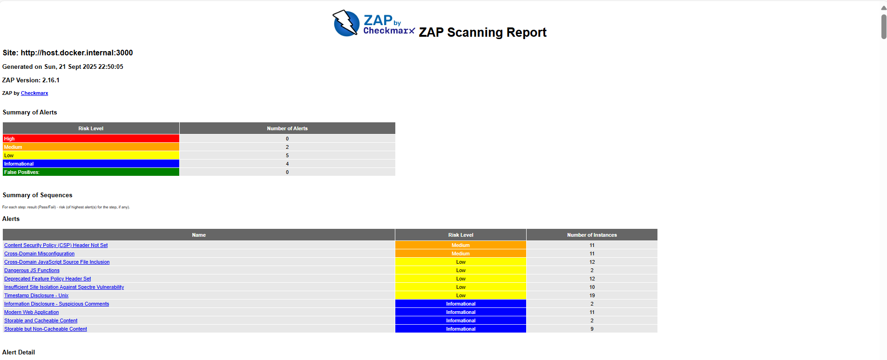
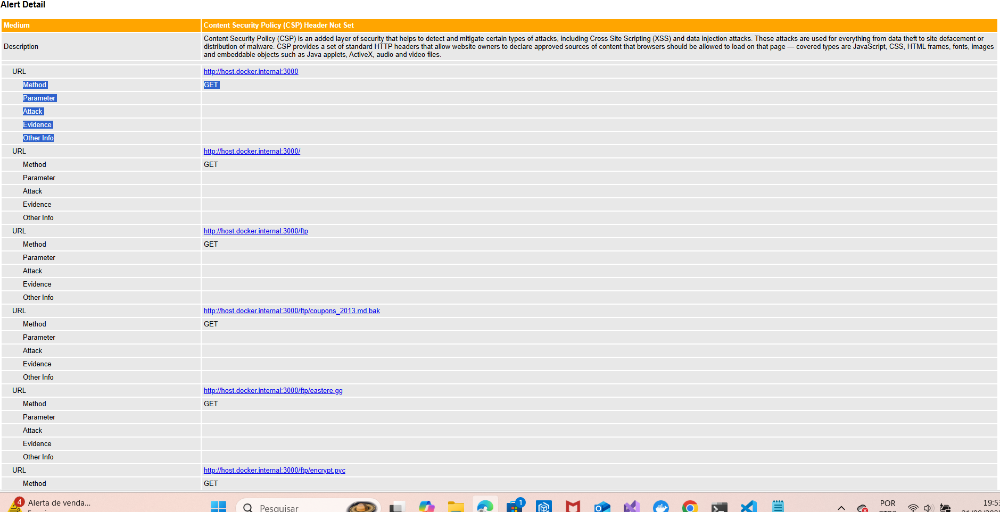
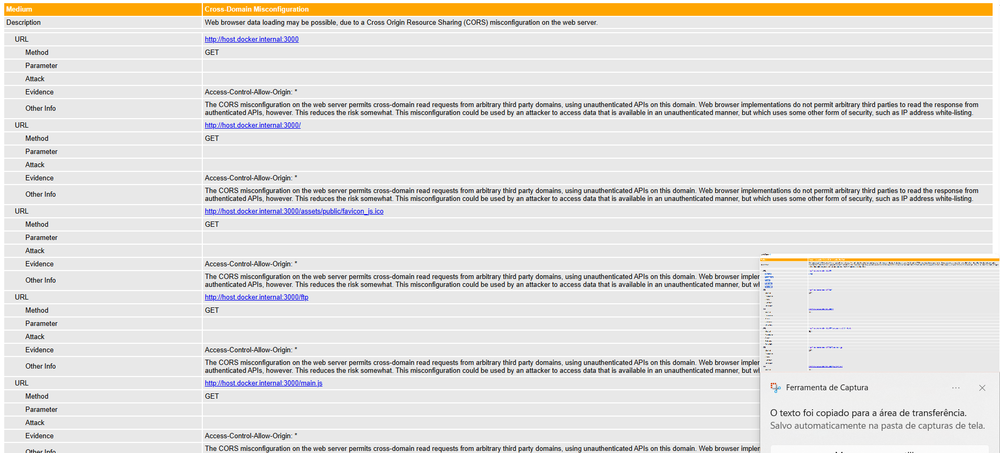
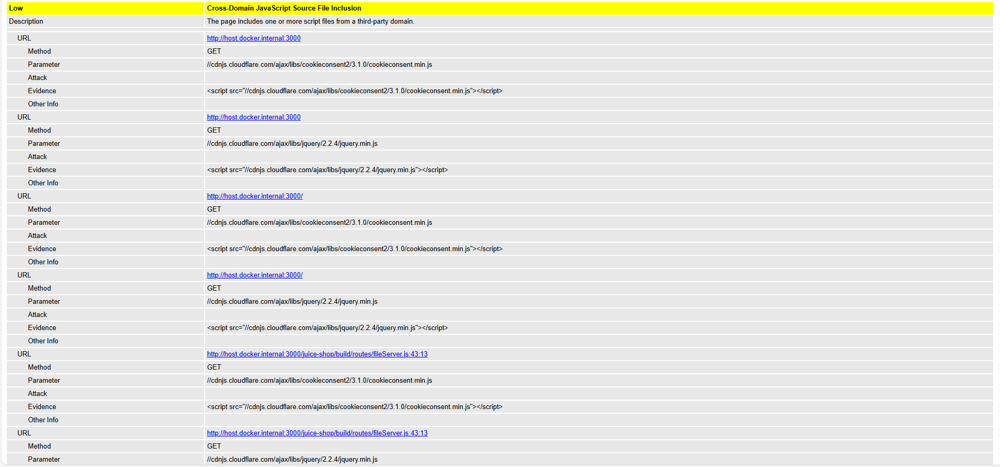
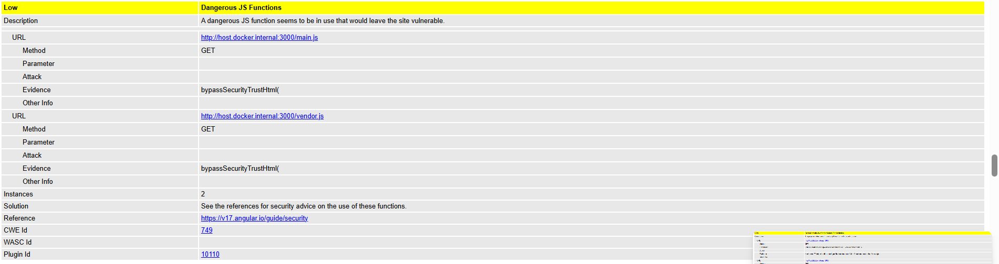
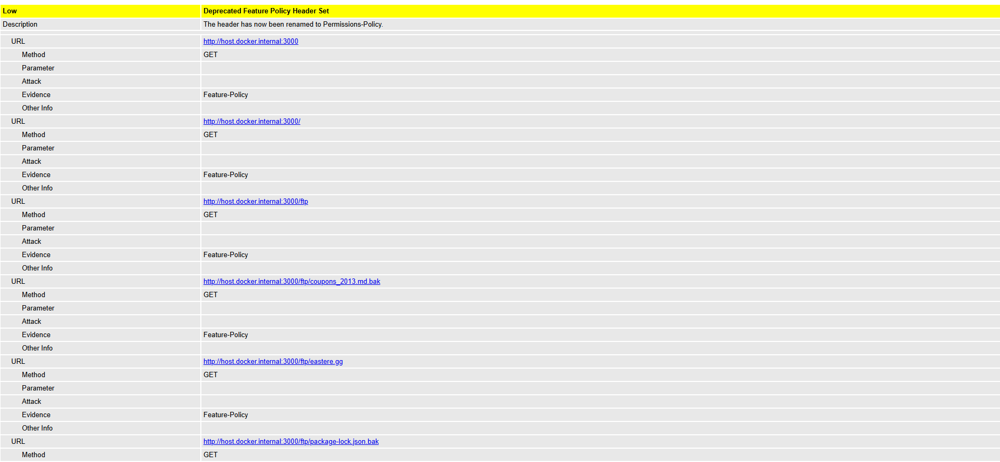
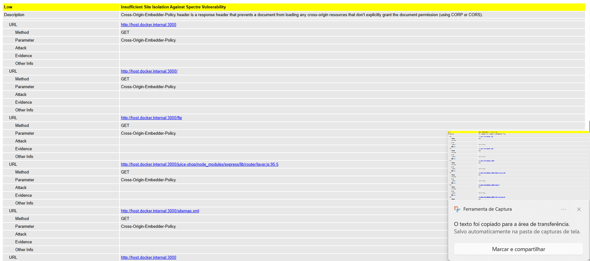
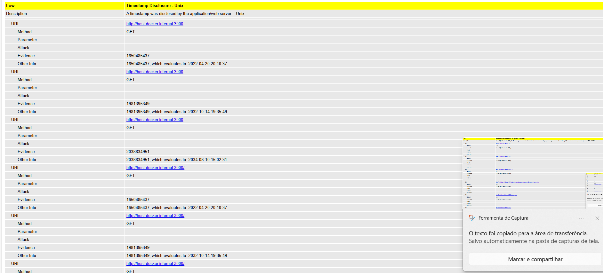
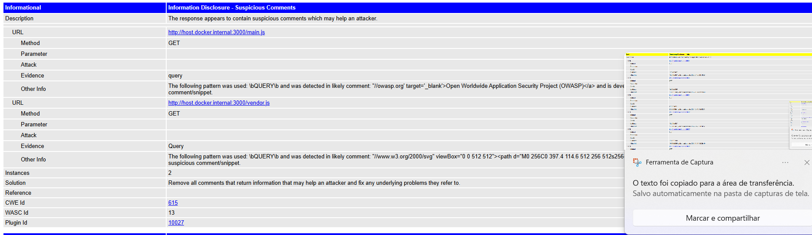
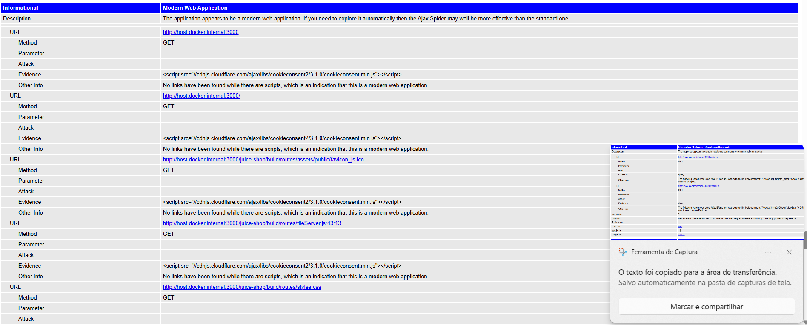
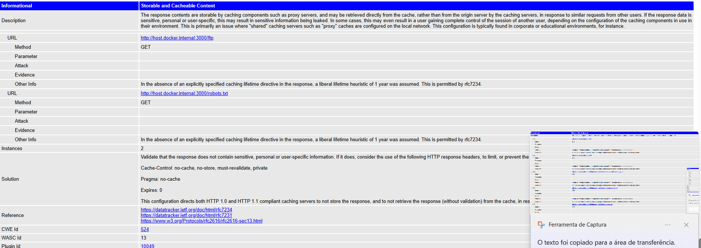
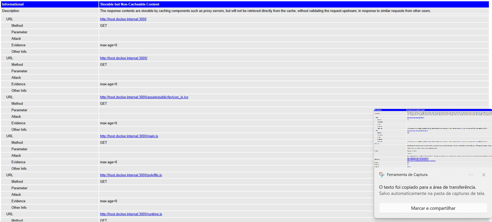
